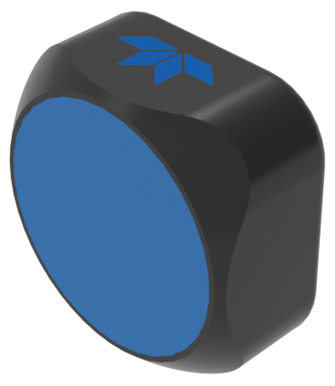

# <table><tr><td valign="middle"></td><td> Wayfinder DVL</td></tr></table>

# Wayfinder Python Driver
Python driver for Wayfinder DVL  
Contains sample code for python drivers

## Sample code
Opening the example python file shows:  
`print("Hello world!")`

## Links
[Shopify link](example.com)

## How to use
description on how to download/run/install/etc  

    $ python hello_world.py
    Hello world!  

## Contact
 +1-858-842-2700  
 rdifs@teledyne.com  
 http://www.teledynemarine.com/rdi/support

 
 

###### Icons made by <a href="https://www.flaticon.com/authors/smashicons" title="Smashicons">Smashicons</a> and <a href="https://www.flaticon.com/authors/freepik" title="Freepik">Freepik</a> from <a href="https://www.flaticon.com/" title="Flaticon">www.flaticon.com</a>

